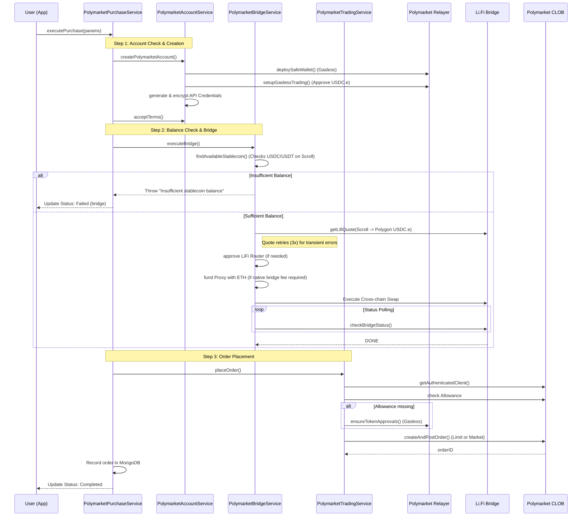

# Polymarket Integration Documentation

This document describes the comprehensive flows for Polymarket integration within ChatterPay, specifically focusing on the unified purchase flow.

## 1. Buy Flow Overview

The buy flow is an orchestrated process that takes a user from having funds on Scroll to holding a position on Polymarket. It handles account setup, cross-chain bridging, and order execution in a single seamless experience.

### 1.1 Process Flow Diagram

---

## 2. Key Components

### 2.1 Balance Check
The system automatically detects which stablecoin the user has available on the source chain (Scroll).
- **Service**: `PolymarketBridgeService.findAvailableStablecoin`
- **Logic**:
  - Queries DB for supported stablecoins (USDC, USDT).
  - Checks on-chain balance for each token in priority order.
  - Returns the first token meeting the required amount.
  - If no token has enough balance, a detailed error listing all current balances is returned to the user.

### 2.2 Account Check & Creation (Gasless Infrastructure)
ChatterPay uses Polymarket's gasless trading infrastructure, which relies on Gnosis Safe wallets.
- **Service**: `PolymarketRelayerService`
- **Mechanism**:
  - **Safe Wallet**: A deterministic Safe address is derived for every user based on their EOA address.
  - **Deployment**: The Safe is deployed gaslessly via the Polymarket Relayer upon the first purchase.
  - **RelayClient**: Authenticates using Builder Program credentials (API Key, Secret, Passphrase).
  - **Sponsorship**: The Relayer sponsors all on-chain operations (Safe deployment, approvals).

### 2.3 Li.Fi Bridge (Scroll → Polygon)
Bridging is handled by Li.Fi to ensure the best route and rates for USDC.e.
- **Destination**: Funds are bridged directly to the user's **Polygon Safe address**.
- **Quote Retries**: The system implements 3 retries with exponential backoff for `getLifiQuote` to handle transient network or provider errors.
- **Native Fee Handling**: Some bridge tools (e.g., Across) require a small native ETH fee. The service automatically detects this and funds the user's proxy wallet from a backend "gas" signer if necessary.
- **Status Polling**: The system polls the Li.Fi API every 10 seconds for up to 5 minutes to track the cross-chain transaction to completion.

### 2.4 Order Placement
Orders are placed on the Polymarket CLOB (Central Limit Order Book).
- **Service**: `PolymarketTradingService`
- **Order Types**:
  - **GTC (Good Till Cancelled)**: Default limit order.
  - **FOK (Fill Or Kill)**: Market order that must be filled immediately or cancelled.
  - **GTD (Good Till Date)**: Order with an expiration.
- **Authentication**: Uses internal API credentials (key, secret, passphrase) derived during account creation.

### 2.5 Error Handling & Reversals
- **Step-wise Persistence**: Every step (Account, Bridge, Order) updates a "purchase record" in MongoDB. This allows the frontend to show real-time progress.
- **Failures**: If any step fails:
  - The process stops and the record is marked as `failed`.
  - **No Automatic Reversal**: Currently, funds are not automatically bridged back to the source chain. They remain on the chain where the failure occurred (e.g., if the bridge finished but the order failed, funds stay as USDC.e on Polygon).
- **Retries**: Explicit retries are implemented for API calls (LiFi Quote), while on-chain status checks use polling.

### 2.6 Gasless Structure (Summary)
| Operation | Gas Paid By | Mechanism |
| :--- | :--- | :--- |
| Safe Deployment | Polymarket Relayer | `RelayClient.deploy()` |
| Token Approvals | Polymarket Relayer | `RelayClient.execute()` |
| Order Placement | Polymarket (CLOB) | EIP-712 Signatures |
| Bridge Execution | ChatterPay Backend | `ChatterPay.execute()` + Backend Signer |
