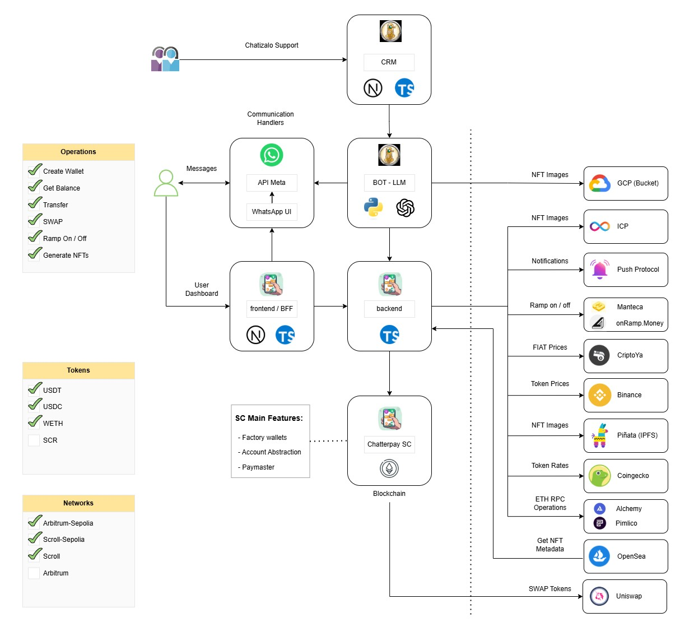

# ChatterPay

ChatterPay is a Wallet for WhatsApp that integrates AI and Account Abstraction, enabling any user to use blockchain easily and securely without technical knowledge.

> Built for: [Level Up Hackathon - Ethereum Argentina 2024](https://ethereumargentina.org/) & [Ethereum Uruguay 2024](https://www.ethereumuruguay.org/)

> Built By: [mpefaur](https://github.com/mpefaur), [tomasfrancizco](https://github.com/tomasfrancizco), [TomasDmArg](https://github.com/TomasDmArg), [gonzageraci](https://github.com/gonzageraci), [dappsar](https://github.com/dappsar)


## Get started with our Bot 🤖

[](https://wa.me/5491164629653)

> Create Wallet, Transfer, Swap, and mint NFTs — directly from WhatsApp!

# Components

-   Landing Page ([product](https://chatterpay.net), [source code](https://github.com/P4-Games/ChatterPay))
-   User Dashboard Website ([product](https://chatterpay.net/dashboard), [source code](https://github.com/P4-Games/ChatterPay))
-   Backend API ([source code](https://github.com/P4-Games/ChatterPay-Backend)) (this Repo)
-   Smart Contracts ([source code](https://github.com/P4-Games/ChatterPay-SmartContracts))
-   Data Indexing (Subgraph) ([source code](https://github.com/P4-Games/ChatterPay-Subgraph))
-   Bot AI Admin Dashboard Website ([product](https://app.chatizalo.com/))
-   Bot AI (Chatizalo) ([product](https://chatizalo.com/))
-   Bot AI Admin Dashboard Website ([product](https://app.chatizalo.com/))

<p>&nbsp;</p>




# About this Repo

This repository contains the backend API source code.

**Built With**:

-   Framework: [Bun.js](https://bun.sh/)
-   Language: [TypeScript](https://www.typescriptlang.org)
-   Database: [mongodb](https://www.mongodb.com)
-   Database ODM: [mongoose](https://mongoosejs.com/)
-   web3 SDK: [Alchemy](https://www.alchemy.com/sdk)
-   web3 Library: [ethers.js](https://docs.ethers.org/v5/)
-   web3 Swaps: [Uniswap V3](https://app.uniswap.org/)
-   web3 Chainlink Price Feeds: [ChainLink](https://docs.chain.link/data-feeds/price-feeds/)
-   Source Code Documentation: [jsDoc](https://jsdoc.app/)

# Getting Started

**1. Install these Requirements**:

-   [git](https://git-scm.com/)
-   [bun](https://bun.sh/)
-   [mongoDb](https://www.mongodb.com/docs/manual/installation/)

**2. Clone repository**:

```bash
git clone https://github.com/P4-Games/ChatterPay-Backend
cd ChatterPay-Backend
```

**3. Complete .env file**:

Create a .env file in the root folder and populate it with keys and values described in [example_env file](./example_env).

**4. Install Dependencies**:

```bash
bun install
```

**5. Start Server**:

```bash
bun run dev
```

Then, open in: `http://localhost:3000`.

**6. Testing**:

```bash
# Run tests
bun test
yarn test
npx vitest
```

```bash
yarn test:coverage
npx vitest --coverage
```

# Additional Info

## Project Structure

-   `src/`:
    -   `api/`: Definition of API paths.
    -   `controllers/`: Helpers that interact with the DB and other services.
    -   `services/`: Business logic.
    -   `models/`: Data model definitions.
    -   `middleware/`: Custom middleware.
    -   `utils/`: Utility functions.
    -   `config/`: Application configurations.
    -   `types/`: Type and interface definitions.
    -   `constants/`: Constants and enumerations.
    -   `errors/`: Custom error classes.
    -   `index.ts`: Application entry point.
-   `tests/`: Unit Tests.
-   `.gitignore`: Specifies files and directories ignored by Git.
-   `package.json`: Project configuration and dependencies.
-   `tsconfig.json`: TypeScript configuration.
-   `README.md`: This File.
-   `.env.example`: Example Environment File.

## Technical Documentation

If you would like to explore more details about the source code, you can review this [link](.doc/content.md).


## Contribution

Thank you for considering helping out with the source code! We welcome contributions from anyone on the internet, and are grateful for even the smallest of fixes!

If you'd like to contribute to ChatterPay, please fork, fix, commit and send a pull request for the maintainers to review and merge into the main code base. If you wish to submit more complex changes though, please check up with the [core devs](https://github.com/P4-Games/chatterPay-backend/graphs/contributors) first to ensure those changes are in line with the general philosophy of the project and/or get some early feedback which can make both your efforts much lighter as well as our review and merge procedures quick and simple.

Please make sure your contributions adhere to our [coding guidelines](./.doc/development/coding-guidelines.md).

_Contributors_: 

* [P4Troy](https://github.com/mpefaur) - [dappsar](https://github.com/dappsar) - [tomasDmArg](https://github.com/TomasDmArg) - [gonzageraci](https://github.com/gonzageraci)

* See more in: <https://github.com/P4-Games/chatterPay-backend/graphs/contributors>

<p>&nbsp;</p>

---

[](https://x.com/chatterpay)
[](https://www.instagram.com/chatterpayofficial)
[](https://www.linkedin.com/company/chatterpay)
[](https://www.facebook.com/chatterpay)
[](https://www.youtube.com/@chatterpay)
[](https://chat.whatsapp.com/HZJrBEUYyoF8FtchfJhzmZ)
